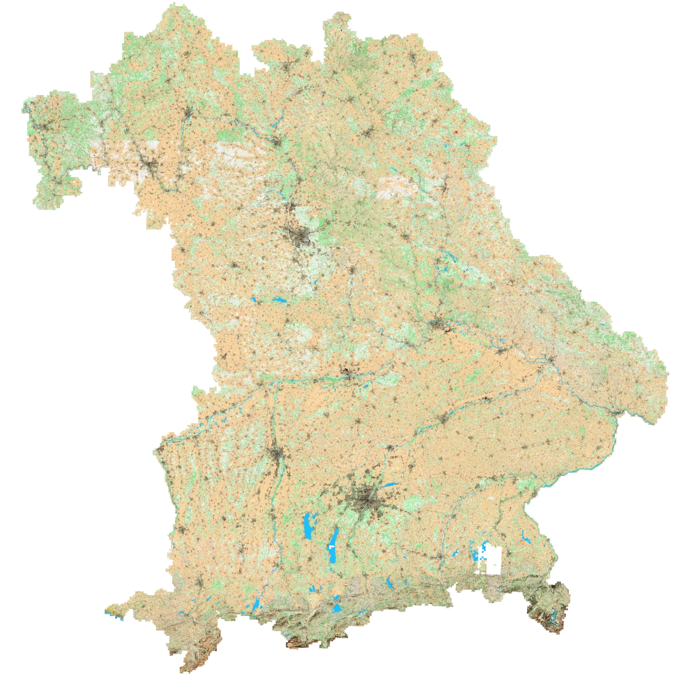
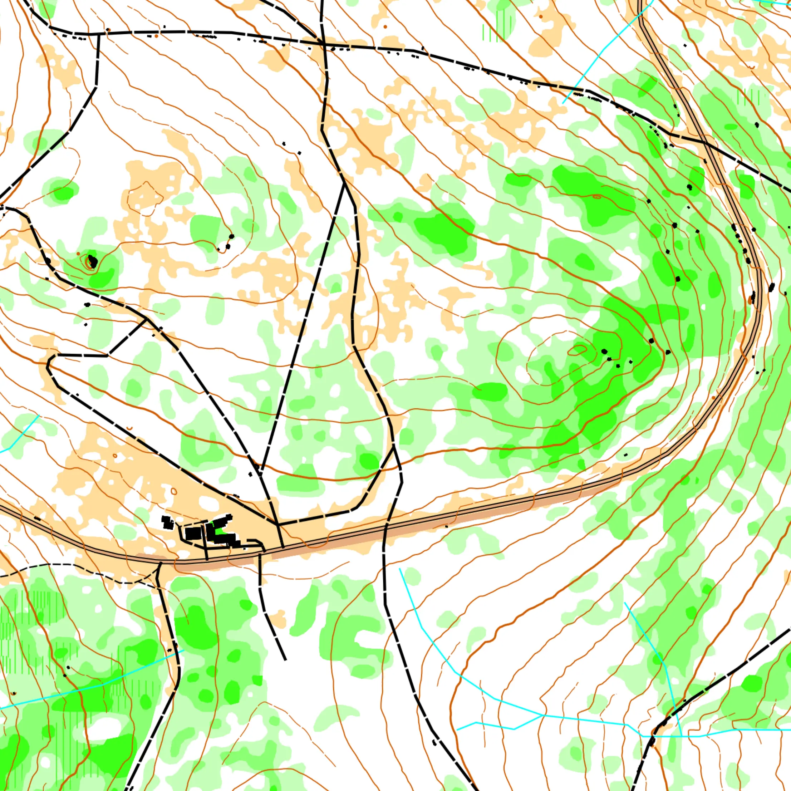

# Mapant Germany

Mapant Germany ist eine automatisch generierte Orientierungslaufkarte. Sie kann nützlich sein für Trainingszwecke, 
oder um Geländeabschnitte für richtige OL Karten zu finden. Sie begann als Mapant Bayern und deckt ganz Bayern ab;
die anderen Bundesländer folgen, wo ihre LiDAR-Daten frei verfügbar sind, eines nach dem anderen. In kleinen
Zoomstufen zeigt die Karte, welche das sind.

  
  

Die Karte wurde mit [karttapullautin](https://github.com/karttapullautin/karttapullautin) und der
[mapant-nf](https://github.com/grst/mapant-nf) pipeline erstellt.
 * Wie die LIDAR-Kacheln verarbeitet wurden, ist in [`processing_pipeline`](https://github.com/grst/mapant-bayern/tree/main/processing_pipeline) dokumentiert.
 * Die Benutzeroberfläche liegt in [`webapp`](https://github.com/grst/mapant-bayern/tree/main/webapp).

Die vollständige Karte von Bayern kann im [pmtiles](https://docs.protomaps.com/pmtiles/)-Format heruntergeladen werden (ca. 180 GB)
 und darf unter der Lizenz [CC-BY-NC 4.0](https://creativecommons.org/licenses/by-nc/4.0/deed.de) weiterverwendet werden:

  * [mapant-bayern.pmtiles](https://mapant-tiles.orienteering-allgaeu.de/mapant-bayern.pmtiles).

Wenn du eine andere Lizenz benötigst, [melde dich gerne](mailto:gregor@sturmcloud.org), um darüber zu sprechen.

## Datenquellen

 * Geodaten Bayern LIDAR (© Bayerische Vermessungsverwaltung ([CC-BY-4.0](https://creativecommons.org/licenses/by/4.0/deed.de)))
 * Testregionen: LiDAR von Rheinland-Pfalz (© GeoBasis-DE / LVermGeoRP), Nordrhein-Westfalen (© Geobasis NRW,
   [dl-de/zero-2-0](https://www.govdata.de/dl-de/zero-2-0)), Brandenburg (© GeoBasis-DE/LGB) und Sachsen (© GeoSN),
   alle anderen [dl-de/by-2-0](https://www.govdata.de/dl-de/by-2-0)
 * Grenzen der Bundesländer von [Natural Earth](https://www.naturalearthdata.com/) (gemeinfrei)
 * OpenStreetMap von [geofabrik.de](https://download.geofabrik.de/europe/germany.html) (© OpenStreetMap contributors ([ODbL 1.0](http://opendatacommons.org/licenses/odbl/)))
