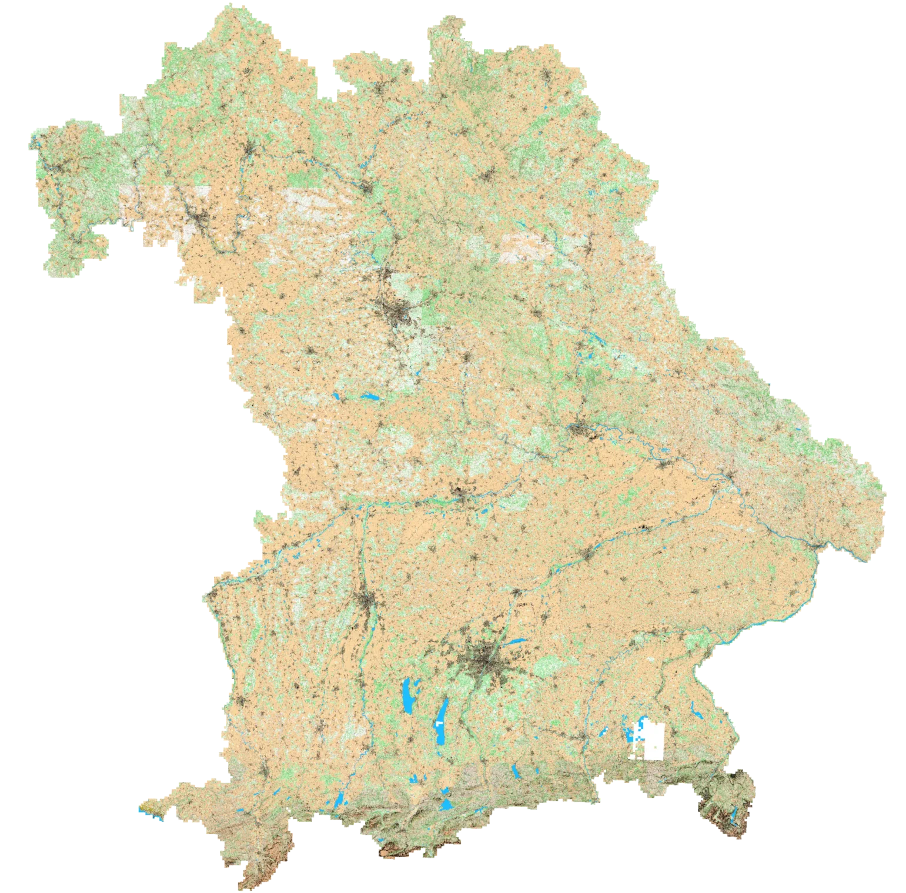
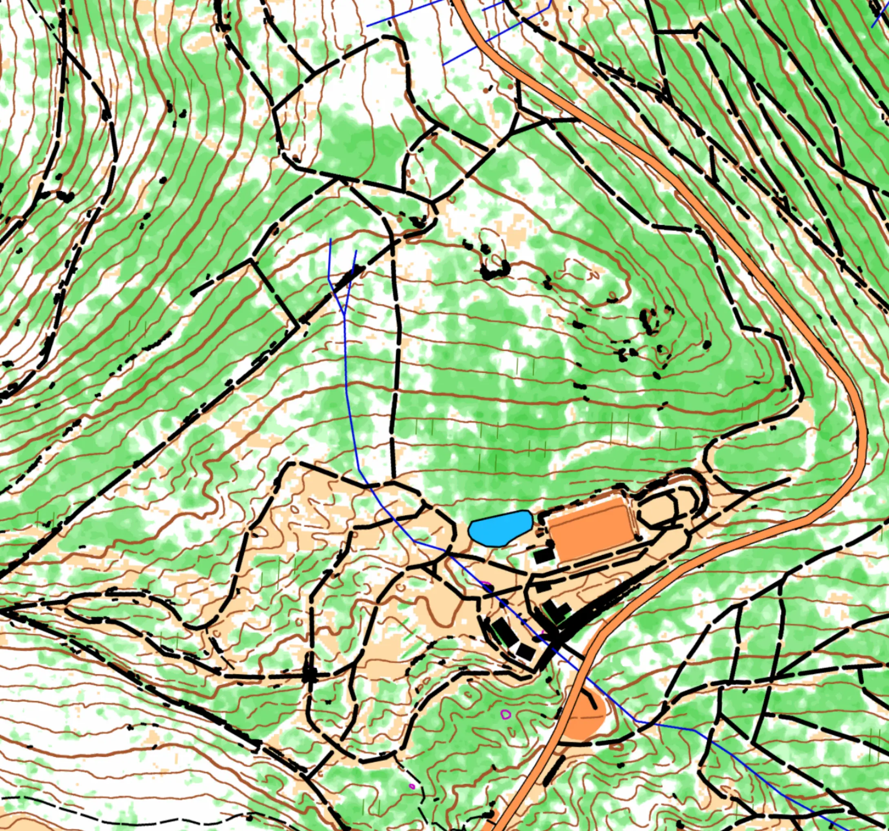

# Mapant Bayern

Mapant Bayern is an automatically generated orienteering map. It can be useful for training purposes or for identifying
new terrains to be properly mapped. 

  
  

It has been generated using the amazing [karttapullautin](https://github.com/karttapullautin/karttapullautin) software
and processed through the [mapant-nf](https://github.com/grst/mapant-nf) pipeline. 
 * Details on how the LIDAR tiles were processed are documented in [`processing_pipeline`](https://github.com/grst/mapant-bayern/tree/main/processing_pipeline). 
 * The user interface is available in [`webapp`](https://github.com/grst/mapant-bayern/tree/main/webapp).

The full map can be downloaded in [pmtiles](https://docs.protomaps.com/pmtiles/) format (ca. 180 GB) and may
 be reused under [CC-BY-NC 4.0](https://creativecommons.org/licenses/by-nc/4.0/deed.en) license: 

  * [mapant-bayern.pmtiles](https://mapant-tiles.orienteering-allgaeu.de/mapant-bayern.pmtiles).

If you need a different license, feel free to [reach out](mailto:gregor@sturmcloud.org) to discuss. 

## Data sources

 * Geodaten Bayern LIDAR (© Bayerische Vermessungsverwaltung ([CC-BY-4.0](https://creativecommons.org/licenses/by/4.0/deed.en)))
 * OpenStreetMap obtained from [geofabrik.de](https://download.geofabrik.de/europe/germany/bayern.html) (© OpenStreetMap contributors ([ODbL 1.0](http://opendatacommons.org/licenses/odbl/)))
